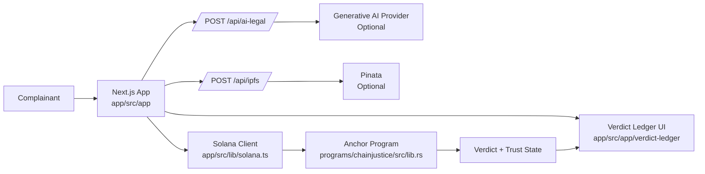

# ChainJustice

## AI Accountability Court for the Real World

AI argues both sides. Human jurors decide. Solana records the verdict forever.

## Project Pitch
ChainJustice is a decentralized dispute system for AI harm and governance cases. A complainant files a case with evidence, the platform generates adversarial prosecution and defense briefs plus a neutral synthesis, and human jurors issue the final verdict. The result is written into a public Verdict Ledger with trust impacts and precedent links, creating a transparent accountability layer that courts, regulators, builders, and users can inspect.

## Problem Statement
AI systems increasingly cause meaningful harm, but accountability is fragmented, opaque, and hard to audit.

- Evidence is scattered and easy to dispute.
- Case review is slow and inconsistent.
- Model trust history is not visible in one place.
- Pure AI judgment is unsafe for legal decisions.
- Pure human review can be slow and miss technical nuance.

## Solution Overview
ChainJustice combines adversarial AI analysis with human legal authority.

1. Case intake: user files a complaint and uploads evidence.
2. Evidence handling: files are pinned to IPFS or safely mocked when credentials are missing.
3. Adversarial Council: AI generates prosecution, defense, and neutral advisory briefs.
4. Juror decision: humans vote and remain the only final authority.
5. Verdict Ledger: outcomes are surfaced in an accountability registry and can be anchored on-chain.

## Architecture



### Runtime Modes

1. Local frontend demo-safe mode.
2. Local validator mode for Anchor testing.
3. Devnet deployment mode.
4. Production frontend deployment mode.

## Adversarial Council
The Adversarial Council is the core analysis engine exposed through [app/src/app/api/ai-legal/route.ts](app/src/app/api/ai-legal/route.ts).

For each case, it produces:

1. Prosecution brief: strongest arguments against the accused model.
2. Defense brief: strongest arguments for the accused model.
3. Neutral synthesis: unresolved questions, confidence, and juror guidance.

This structure reduces one-sided prompting and helps jurors see competing interpretations before they vote.

## Why AI Is Advisory Only
AI is excellent at synthesis but not legitimate as a final legal authority.

- Models can hallucinate or overfit to prompt framing.
- Evidence weighting is ultimately a governance decision, not just a statistical one.
- Juror legitimacy and accountability must remain human.

ChainJustice enforces this by design with explicit advisory fields and disclaimers in API and UI flows, while human jurors remain final authority.

## Verdict Ledger
The Verdict Ledger page at [app/src/app/verdict-ledger/page.tsx](app/src/app/verdict-ledger/page.tsx) is the public accountability surface.

It tracks:

- model trust trajectory,
- case outcomes,
- upheld versus dismissed complaints,
- recurring harm patterns,
- insurance and risk indicators.

If chain access is unavailable, it degrades gracefully to demo-safe fallback data so judges and users can still evaluate product behavior end to end.

## Repo Structure (Current Paths)

This workspace contains multiple folders. The active project is chainjustice1.

```text
chainjustice1/
  Anchor.toml
  Cargo.toml
  package.json
  tests/
    chainjustice.ts
  programs/
    chainjustice/
      src/
        lib.rs
        instructions/
  app/
    package.json
    src/
      app/
        page.tsx
        file-case/page.tsx
        case/[id]/page.tsx
        juror/page.tsx
        registry/page.tsx
        precedents/page.tsx
        verdict-ledger/page.tsx
        dashboard/page.tsx
        api/
          ai-legal/route.ts
          ipfs/route.ts
      components/
      hooks/
      lib/
      types/
```

## Environment Variables
Use [chainjustice1/.env.example](.env.example) and [chainjustice1/app/.env.example](app/.env.example) as source of truth.

### Required for expected wallet and RPC behavior

- NEXT_PUBLIC_SOLANA_NETWORK
- NEXT_PUBLIC_SOLANA_RPC_URL
- NEXT_PUBLIC_CHAINJUSTICE_PROGRAM_ID

### Optional integrations

- GOOGLE_API_KEY or GEMINI_API_KEY
- PINATA_JWT or PINATA_API_KEY plus PINATA_SECRET
- AI_COUNCIL_PROVIDER_POOL
- NEXT_PUBLIC_GATEWAY_URL
- NEXT_PUBLIC_PROGRAM_ID (alias)

## Local Frontend Setup
From [chainjustice1/package.json](package.json) scripts:

```bash
npm run setup
```

Create local env file:

- Windows PowerShell:

```powershell
Copy-Item app/.env.example app/.env.local
```

- macOS or Linux:

```bash
cp app/.env.example app/.env.local
```

Run frontend:

```bash
npm run frontend:dev
```

Validate frontend before demo or deploy:

```bash
npm run frontend:validate
```

## Local Anchor Setup
Prerequisites:

1. Rust toolchain.
2. Solana CLI with solana-test-validator.
3. Anchor CLI.

Build program:

```bash
npm run anchor:build
```

Anchor config currently uses localnet provider defaults in [chainjustice1/Anchor.toml](Anchor.toml).

The default verification command is local-validator based:

```bash
npm run anchor:test
```

## Local Validator Test Flow

```bash
npm run anchor:test
```

This runs local cluster tests from [chainjustice1/tests/chainjustice.ts](tests/chainjustice.ts).

## Devnet Deploy Flow
Build and deploy:

```bash
npm run anchor:build
npm run anchor:deploy:devnet
```

Optional devnet test run:

```bash
npm run anchor:test:devnet
```

Use devnet only for manual deployment or demo environments. Do not use devnet as the default verification path.

Before devnet deploy, ensure wallet funding and verify program IDs in [chainjustice1/Anchor.toml](Anchor.toml).

## Frontend Deployment Flow
Vercel deployment is wired via root scripts in [chainjustice1/package.json](package.json).

### Vercel project settings

1. Root directory: app
2. Install command: npm ci
3. Build command: npm run build
4. Start command: npm run start

### CLI deploy from repo root

```bash
npm run deploy:frontend:vercel
npm run deploy:frontend:vercel:prod
```

## API Routes

| Route | Method | Purpose | Fallback Behavior |
|---|---|---|---|
| /api/ai-legal | POST | Adversarial legal analysis actions and advisory briefs | Returns structured advisory-safe response when provider is unavailable or output is invalid |
| /api/ipfs | POST | Evidence upload and CID response | Returns mock CID payload when Pinata credentials are missing |

Routes are implemented at [app/src/app/api/ai-legal/route.ts](app/src/app/api/ai-legal/route.ts) and [app/src/app/api/ipfs/route.ts](app/src/app/api/ipfs/route.ts).

## Demo Walkthrough
Use this flow for a clean judge demo.

1. Open landing page and explain AI advisory plus human final authority.
2. File a case in [app/src/app/file-case/page.tsx](app/src/app/file-case/page.tsx).
3. Upload at least one evidence file.
4. Open case details in [app/src/app/case/[id]/page.tsx](app/src/app/case/[id]/page.tsx) and show adversarial briefs.
5. Open juror portal in [app/src/app/juror/page.tsx](app/src/app/juror/page.tsx) and cast final human vote.
6. Open Verdict Ledger in [app/src/app/verdict-ledger/page.tsx](app/src/app/verdict-ledger/page.tsx) to show accountability signals.
7. If external keys are absent, explicitly show graceful fallback responses and explain reliability by design.

## Why Use AI in a Case Against AI?
Short answer: because AI is useful as an expert witness, not as a judge.

Judge-proof framing:

- AI can surface technical patterns and contradictory evidence faster than manual review.
- Adversarial prompting forces competing narratives, reducing one-sided framing.
- Human jurors preserve legal legitimacy, normative judgment, and accountability.
- ChainJustice combines the speed of machine analysis with the authority of human decision-making.

So the platform is not "AI judging AI." It is "AI briefing humans who judge AI."

## Command Cheat Sheet

```bash
# setup
npm run setup

# frontend
npm run frontend:dev
npm run frontend:validate
npm run frontend:build
npm run frontend:start

# anchor local
npm run anchor:build
npm run anchor:test

# anchor devnet
npm run anchor:deploy:devnet
npm run anchor:test:devnet

# vercel
npm run deploy:frontend:vercel:prod
```

## Roadmap

1. Full on-chain case lifecycle parity for all UI actions.
2. Juror identity and anti-collusion enhancements.
3. Stronger precedent search and citation quality scoring.
4. Multi-provider adversarial council with transparent confidence calibration.
5. Automated policy compliance packs for enterprise and regulators.
6. End-to-end observability dashboard for audit trails and response provenance.

## Troubleshooting

### anchor command not found
Install Anchor CLI and confirm it is on PATH.

### solana-test-validator not found
Install Solana CLI and verify validator binary is available.

### frontend build fails due to missing env values
Copy [app/.env.example](app/.env.example) to app/.env.local and set required NEXT_PUBLIC values.

### wallet connects but no on-chain data appears
Check RPC URL, network, and program ID alignment across env and [chainjustice1/Anchor.toml](Anchor.toml).

### /api/ipfs returns fallback payload
Pinata credentials are missing or invalid. Set PINATA_JWT or PINATA_API_KEY and PINATA_SECRET.

### /api/ai-legal returns advisory mock output
AI provider key is missing or provider output did not validate. Set GOOGLE_API_KEY or GEMINI_API_KEY.

### vercel deploy works but app cannot resolve routes
Ensure Vercel root directory is app and build command is npm run build.

---

ChainJustice is built for transparent AI accountability: rigorous analysis, human legitimacy, and deployable engineering.
