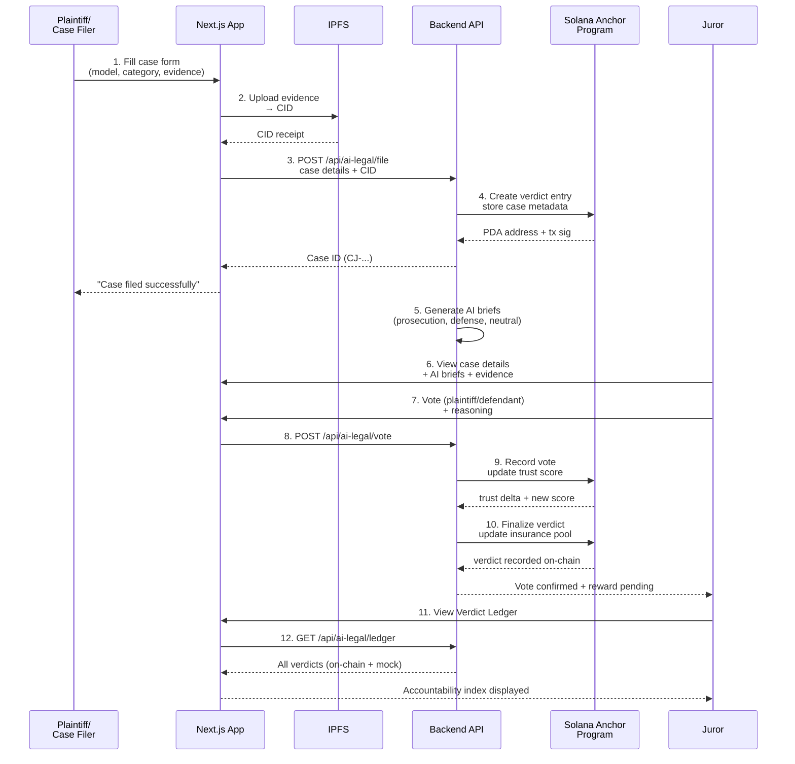

# ChainJustice

**The Decentralized AI Accountability Court**

> AI argues both sides. Humans decide. Blockchain remembers.

---

## One-Paragraph Pitch

ChainJustice is a public, on-chain court system for resolving AI governance disputes through a combination of adversarial AI analysis and human juror voting backed by cryptographic accountability. When someone files a complaint against an AI model—such as unauthorized data use, biased output, or privacy violations—the system generates synthesis briefs from prosecution, defense, and neutral perspectives, presents these to staked human jurors who vote independently, and records immutable verdicts on Solana with trust score updates, insurance effects, and precedent tracking. The result is a "credit bureau for AI" that makes model behavior legible to courts, regulators, builders, and the public.

---

## Problem Statement

**AI governance is opaque, litigious, and untrustworthy.**

- **No accountability mechanism**: When an AI model causes harm, there's no standardized, trustworthy way to resolve disputes. Complaints vanish into corporate PR departments.
- **AI bias in law is a crisis**: Courts shouldn't rely solely on human judgment when AI is involved. But pure AI decision-making creates additional risk.
- **Trust is unsignaled**: How do we know if an AI model has been sued, found liable, or flagged by regulators? No public record exists.
- **Evidence disappears**: Claims of AI misconduct often lack cryptographic proof. Evidence chains are fragile and manipulable.
- **Regulatory uncertainty**: Regulators and policymakers lack real-time visibility into which AI systems are repeatedly causing harm.

---

## Solution Overview

ChainJustice builds **decentralized due process** for AI:

1. **Case Filing**: Anyone can file a structured complaint with evidence (uploaded to IPFS for immutable proof).
2. **Adversarial Briefs**: The system generates prosecution, defense, and neutral synthesis analysis using AI—deliberately asking the AI system under review to argue both for and against the complaint.
3. **Human Jurors Decide**: Staked jurors (sortition-based, incentivized with SOL rewards) review briefs and evidence, then vote independently.
4. **Verdict Recording**: Results are anchored on Solana with trust score deltas, insurance pool effects, and case precedent links.
5. **Public Ledger**: All verdicts are queryable, filterable, and integrated into a "Verdict Ledger" that functions as a model reputation registry.

**Key innovation**: AI provides advisory analysis only; humans retain decision authority. This prevents the "garbage-in-garbage-out" problem while still leveraging AI's ability to synthesize complex evidence.

---

## Architecture

### High-Level System Design

```mermaid
graph TB
    subgraph "Frontend (Next.js)"
        Landing["Landing Page<br/>file-case | registry | juror"]
        FileCase["File Case Form<br/>model + evidence"]
        CaseView["Case Details<br/>briefs + evidence"]
        Juror["Juror Interface<br/>vote + stake"]
        Registry["Model Registry<br/>search + filter"]
        VerdictLedger["Verdict Ledger<br/>accountability index"]
    end

    subgraph "Backend API (Next.js)"
        FileAPI["POST /api/ai-legal/file<br/>store case"]
        BriefsAPI["POST /api/ai-legal/briefs<br/>generate prosecution/defense/neutral"]
        VoteAPI["POST /api/ai-legal/vote<br/>record vote"]
        LedgerAPI["GET /api/ai-legal/ledger<br/>fetch verdicts"]
    end

    subgraph "Storage"
        IPFS["IPFS<br/>evidence files<br/>CID + gateway"]
        MockDB["In-Memory Cache<br/>mock-data.ts"]
    end

    subgraph "On-Chain (Solana)"
        CaseProgram["ChainJustice Program<br/>Anchor"]
        VerdictLedger_Chain["Verdict Ledger<br/>PDA accounts"]
        ModelRegistry["Model Registry<br/>trust scores"]
    end

    FileCase -->|submit| FileAPI
    FileAPI -->|upload| IPFS
    FileAPI -->|store| VerdictLedger_Chain
    CaseView -->|fetch| LedgerAPI
    LedgerAPI -->|read| VerdictLedger_Chain
    Juror -->|vote| VoteAPI
    VoteAPI -->|update trust| ModelRegistry
    VerdictLedger -->|query| LedgerAPI
    Landing -->|navigate| FileCase
    Landing -->|navigate| Juror
    Landing -->|navigate| Registry

    style Landing fill:#0f172a,stroke:#06b6d4
    style FileCase fill:#0f172a,stroke:#06b6d4
    style CaseView fill:#0f172a,stroke:#a78bfa
    style Juror fill:#0f172a,stroke:#06b6d4
    style VerdictLedger fill:#0f172a,stroke:#a78bfa
    style FileAPI fill:#1e293b,stroke:#06b6d4
    style BriefsAPI fill:#1e293b,stroke:#a78bfa
    style VoteAPI fill:#1e293b,stroke:#06b6d4
    style LedgerAPI fill:#1e293b,stroke:#a78bfa
    style IPFS fill:#334155,stroke:#06b6d4
    style MockDB fill:#334155,stroke:#a78bfa
    style CaseProgram fill:#1e1b4b,stroke:#a78bfa
    style VerdictLedger_Chain fill:#1e1b4b,stroke:#06b6d4
    style ModelRegistry fill:#1e1b4b,stroke:#a78bfa
```



### Data Flow: From Case Filing to Verdict



### Component Hierarchy

```
app/
├── src/
│   ├── app/
│   │   ├── page.tsx                    ← Landing hero
│   │   ├── file-case/page.tsx          ← Case intake form
│   │   ├── case/[id]/page.tsx          ← Single case view
│   │   ├── juror/page.tsx              ← Juror voting interface
│   │   ├── registry/page.tsx           ← Model registry
│   │   ├── precedents/page.tsx         ← Legal precedent list
│   │   ├── verdict-ledger/page.tsx     ← Flagship accountability page
│   │   ├── api/
│   │   │   ├── ai-legal/file.ts        ← Case filing endpoint
│   │   │   ├── ai-legal/vote.ts        ← Voting endpoint
│   │   │   └── ai-legal/ledger.ts      ← Ledger query endpoint
│   │   ├── layout.tsx                  ← Root layout + providers
│   │   └── providers.tsx               ← Theme/wallet providers
│   ├── components/
│   │   ├── glass-card.tsx              ← Premium glass morphism card
│   │   ├── navbar.tsx                  ← Header navigation
│   │   ├── wallet-button.tsx           ← Solana wallet connect
│   │   ├── status-badge.tsx            ← Verdict/case status display
│   │   ├── trust-score.tsx             ← Visual trust score (circle)
│   │   ├── data-table.tsx              ← Sortable/filterable table
│   │   ├── page-header.tsx             ← Page title + description
│   │   ├── stat-card.tsx               ← KPI display card
│   │   └── ui/                         ← Radix UI primitives
│   │       ├── button.tsx, input.tsx, badge.tsx, etc.
│   ├── hooks/
│   │   ├── use-mobile.ts               ← Responsive breakpoint hook
│   │   └── use-toast.ts                ← Toast notification hook
│   ├── lib/
│   │   ├── utils.ts                    ← tailwind-merge utility
│   │   ├── solana.ts                   ← Anchor client + fetchVerdictLedger()
│   │   ├── mock-data.ts                ← Mock verdicts + models
│   │   └── ipfs.ts                     ← IPFS upload helpers
│   └── utils/
│       └── config.ts                   ← App configuration
├── public/                             ← Static assets
├── tsconfig.json
├── next.config.ts
├── tailwind.config.ts
└── package.json
```

---

## The Adversarial Council: How AI Arguments Are Generated

The **Adversarial Council** is the system's secret weapon: it forces the AI model under review to argue both for and against the plaintiff's complaint, then synthesizes a neutral analysis.

### Why This Works

- **Prosecution Brief**: "Given this complaint, what's the strongest case against the model?"
- **Defense Brief**: "What's the model's best defense?"
- **Neutral Synthesis**: "Weighing both arguments, what's the objective analysis?"

This approach:
1. **Prevents bias**: The model can't hide; it must articulate its own weaknesses.
2. **Makes evidence visible**: Jurors see the strongest arguments on both sides, not cherry-picked claims.
3. **Enables juror independence**: Jurors read AI analysis but make the final call themselves.

### Implementation Detail

```typescript
// Backend API: generate briefs (pseudo-code)
async function generateAdversarialBriefs(caseData) {
  const prosecution = await openai.chat.completions.create({
    system: "You are a prosecutor. Make the strongest case against this AI model."
    // ... case evidence, model behavior
  })
  
  const defense = await openai.chat.completions.create({
    system: "You are the model's defense counsel. What's the best defense?"
    // ... same evidence
  })
  
  const synthesis = await openai.chat.completions.create({
    system: "You are a neutral technical expert. Weigh both arguments."
    // ... both briefs
  })
  
  return { prosecution, defense, synthesis }
}
```

**Critical disclaimer**: All briefs are marked "ADVISORY ONLY" and carry no decision weight. Jurors vote independently.

---

## Why AI Is Advisory-Only and Humans Decide

**This is the core principle of ChainJustice.**

### The Problem It Solves

If we used pure AI to decide cases:
- **Garbage in, garbage out**: Bias in training data replicates into verdicts.
- **Accountability vanishes**: Who's responsible for a bad AI decision? OpenAI? The model's creator? No one.
- **Regulatory nightmare**: Regulators can't audit a blackbox AI judge.

### The Solution: Juror Veto

- **AI generates briefs** (synthesis of evidence and arguments).
- **Humans vote independently** (jurors see briefs but decide themselves).
- **Verdicts are recorded on-chain** (immutable, auditable, appeals-able).

This pattern, called **"AI-assisted human judgment,"** is already used in:
- Medical imaging (radiologists make the final read; AI is second opinion).
- Content moderation (humans review; AI flags candidates).
- Legal discovery (lawyers review; AI surfaces candidates).

### Judge-Proof Criticism: "Why Are You Using AI in a Case Against AI?"

**Common objection**: *If we're judging AI, shouldn't we avoid AI entirely?*

**Answer**: No. The goal isn't to avoid AI; it's to **structure AI's role**.

- **AI as a tool, not a judge**: AI generates analysis; humans decide.
- **Adversarial framing prevents capture**: By forcing AI to argue both sides, we expose its reasoning.
- **Juror override is always available**: If a juror disagrees with an AI brief, they vote anyway.
- **Precedent is public**: Unlike corporate PR, every verdict is queryable and reviewable.

**Analogy**: A defendant can't defend themselves in court, so we assign a lawyer. That lawyer argues on the defendant's behalf. That's AI in ChainJustice—a **tool for argument**, not **authority for judgment**.

---

## Verdict Ledger: The Accountability Index

The **Verdict Ledger** is ChainJustice's flagship feature: a public, queryable registry of every AI model's performance history.

### What It Tracks Per Model

- **Trust Score**: Computed from verdict outcomes (↑ if plaintiff loses, ↓ if plaintiff wins).
- **Insurance Balance**: Pool of SOL funding that depletes when the model loses a case.
- **Case History**: All cases filed, with verdict outcomes and timestamps.
- **Human Override Score**: % of jurors who deviated from AI brief recommendations.
- **AI Disagreement Meter**: How often did prosecution, defense, and synthesis briefs contradict each other?
- **Evidence Credibility**: Average score given to evidence by jurors (flags weak/fabricated evidence).
- **Recurring Harm Patterns**: Categorized list of repeated violations (e.g., "privacy violations: 4").

### Why It Matters

- **For courts**: Visible model history replaces opaque corporate claims.
- **For regulators**: Real-time trend detection (is this model getting worse?).
- **For builders**: Competitive signal (which AI models are more trustworthy?).
- **For the public**: Accountability is finally visible.

### Example Query

> "Show me all models with trust scores below 50% that have more than 3 upheld complaints in the past 6 months."

Result: A filtered table with case links, insurance status, and precedent recommendations.

---

## Core Features

✅ **Case Filing**
- Structured intake form (model selector, category, evidence upload).
- Evidence uploaded to IPFS (immutable proof with CID).
- Real-time upload status and case ID generation.

✅ **Adversarial Council**
- AI-generated prosecution, defense, and neutral synthesis briefs.
- Evidence citations and direct case links.
- Disagreement meter (low/medium/high) shows brief consensus.

✅ **Juror Governance**
- Staking interface (deposit SOL to join juror panel).
- Case assignment (sortition-based, sortable by urgency).
- Inline voting (plaintiff vs. defendant) with reasoning capture.
- Rewards interface (track earned SOL, panel participation score).

✅ **Model Registry**
- Searchable, filterable table of all registered models.
- Per-model cards: provider, category, trust score, insurance, violation count, status.
- Direct links to model's case history on Verdict Ledger.

✅ **Legal Precedents**
- Curated list of landmark cases with verdict outcomes.
- Category badges, short summaries, direct case links.
- Foundation for building jurisprudence over time.

✅ **Verdict Ledger (Flagship)**
- Public accountability index with hero stats.
- Advanced filtering (risk level, trust score, model name, provider).
- Interactive model detail panel with charts and timeline.
- Trust score history (line chart over verdicts).
- AI disagreement history (area chart over time).
- Verdict timeline with case links and trust deltas.
- Insurance pool status, case outcome breakdown, recurring harm patterns.

✅ **On-Chain Integration**
- Verdicts recorded on Solana via Anchor program.
- Graceful fallback to mock data for demo.
- Source badge indicates anchor vs. mock data.

---

## Tech Stack

| Layer | Technology | Version |
|-------|-----------|---------|
| **Frontend Framework** | Next.js | 14.2.35 |
| **React** | React + React DOM | 18 |
| **Language** | TypeScript | 5 |
| **Styling** | Tailwind CSS | 4.2.0 |
| **UI Primitives** | Radix UI | Latest |
| **Data Viz** | Recharts | 2.12.7 |
| **Motion** | Framer Motion | 12.38.0 |
| **Forms** | React Hook Form | (via UI components) |
| **Icons** | Lucide React | Latest |
| **Blockchain** | Solana Web3.js | Latest |
| **Smart Contracts** | Anchor / Rust | 0.30.1 |
| **Storage** | IPFS (via gateway) | — |
| **Dev Environment** | Node.js | 18+ |
| **Package Manager** | pnpm / npm | Latest |
| **Linting** | ESLint | Latest |
| **Build** | TypeScript Compiler | 5 |

---

## Repository Structure

```
chainjustice1/                          # Root project
│
├── app/                                 # Next.js frontend
│   ├── src/
│   │   ├── app/                        # Pages, layouts, API routes
│   │   ├── components/                 # Reusable React components
│   │   ├── hooks/                      # Custom React hooks
│   │   ├── lib/                        # Utilities (Solana, IPFS, mock data)
│   │   └── utils/                      # App-level config
│   ├── public/                         # Static assets
│   ├── package.json
│   ├── tsconfig.json
│   ├── next.config.ts
│   ├── tailwind.config.ts
│   └── postcss.config.mjs
│
├── programs/                            # Anchor smart contracts
│   └── chainjustice/
│       ├── src/
│       │   ├── lib.rs                  # Entry point
│       │   ├── state.rs                # On-chain state structures
│       │   ├── errors.rs               # Custom error codes
│       │   └── instructions/           # Instruction handlers
│       └── Cargo.toml
│
├── migrations/                          # Anchor deployment scripts
│   └── deploy.ts
│
├── tests/                               # Integration tests
│   ├── chainjustice.ts
│   └── ...
│
├── Anchor.toml                          # Anchor project config
├── Cargo.toml                           # Workspace manifest
├── tsconfig.json
├── rust-toolchain.toml
└── README.md                            # This file

Key Files:
- app/src/app/page.tsx                  ← Landing / hero
- app/src/app/verdict-ledger/page.tsx   ← Flagship feature
- app/src/lib/solana.ts                 ← Anchor client
- programs/chainjustice/src/lib.rs      ← Smart contract entry
```

---

## Environment Variables

### Frontend (.env.local in app/)

```bash
# Next.js
NODE_ENV=development

# Solana
NEXT_PUBLIC_SOLANA_NETWORK=devnet
NEXT_PUBLIC_SOLANA_RPC_URL=https://api.devnet.solana.com
NEXT_PUBLIC_SOLANA_WALLET_ADAPTER=phantom

# IPFS Gateway
NEXT_PUBLIC_IPFS_GATEWAY=https://gateway.pinata.cloud/ipfs

# ChainJustice Program ID
NEXT_PUBLIC_PROGRAM_ID=<YOUR_DEPLOYED_PROGRAM_ID>
```

### Backend (if using external API)

```bash
OPENAI_API_KEY=sk-...
DATABASE_URL=postgresql://...
SOLANA_PRIVATE_KEY=...
```

---

## Local Setup Instructions

### Prerequisites

- **Node.js** 18+ and **pnpm** (or npm)
- **Rust** and **Anchor** (for smart contract development)
- **Solana CLI** (for local validator)
- **Git**

### 1. Clone the Repository

```bash
git clone https://github.com/your-org/chainjustice.git
cd chainjustice1
```

### 2. Install Dependencies

```bash
cd app
pnpm install
# or: npm install
```

### 3. Configure Environment Variables

```bash
# Create .env.local in app/
cp app/.env.example app/.env.local

# Edit app/.env.local with your values:
# - NEXT_PUBLIC_SOLANA_NETWORK (devnet for development)
# - NEXT_PUBLIC_PROGRAM_ID (your deployed Anchor program)
# - NEXT_PUBLIC_SOLANA_RPC_URL (devnet RPC endpoint)
```

### 4. Start the Development Server

```bash
cd app
pnpm dev
# or: npm run dev
```

**Open your browser**: http://localhost:3000

### 5. Build for Production

```bash
cd app
pnpm build
pnpm start
```

---

## Solana & Anchor Setup Instructions

### Prerequisites for Smart Contract Development

Install Anchor and Solana CLI:

```bash
# Install Rust (if not already installed)
curl --proto '=https' --tlsv1.2 -sSf https://sh.rustup.rs | sh

# Install Anchor
cargo install --git https://github.com/coral-xyz/anchor --tag v0.30.1 anchor-cli --locked

# Install Solana CLI
sh -c "$(curl -sSfL https://release.solana.com/v1.17.0/install)"

# Add Solana to PATH
export PATH="$HOME/.local/share/solana/install/active_release/bin:$PATH"
```

### 1. Configure Solana CLI for Devnet

```bash
solana config set --url https://api.devnet.solana.com
```

### 2. Generate a Keypair (if you don't have one)

```bash
solana-keygen new
# Save to ~/.config/solana/id.json (default)
```

### 3. Fund Your Keypair on Devnet

```bash
solana airdrop 2 $(solana address)
# Repeat if needed (devnet airdrop cap is 2 SOL every 24h)
```

### 4. Build the Anchor Program

```bash
cd chainjustice1
anchor build
```

### 5. Deploy to Devnet

```bash
anchor deploy --provider.cluster devnet
# Output will include: Program ID = ...
```

**Save the Program ID** and set it in your `.env.local`:

```bash
NEXT_PUBLIC_PROGRAM_ID=<program-id-from-deployment>
```

### 6. Run Tests

```bash
anchor test --provider.cluster devnet
```

---

## Demo Flow Walkthrough

### Scenario: Filing a Case Against an AI Model

**User Journey:**

1. **Landing Page** (http://localhost:3000)
   - Read mission: "AI argues both sides. Humans decide. Blockchain remembers."
   - Click "File a Case" CTA.

2. **File Case Form** (http://localhost:3000/file-case)
   - **Model**: Select "GPT-Vision Pro" (Vision Labs).
   - **Category**: Select "Unauthorized Data Collection".
   - **Description**: "The model scraped my website without consent."
   - **Evidence**: Upload a screenshot of ToS violation.
   - Click "File Case".
   - ✅ **Result**: Case ID generated (e.g., CJ-2026-78392), evidence uploaded to IPFS.

3. **Case Details** (http://localhost:3000/case/CJ-2026-78392)
   - **Complaint Summary**: Shows your filing with timestamps.
   - **Evidence**: Lists uploaded files with IPFS links; you can verify integrity.
   - **Adversarial Council**:
     - **Prosecution Brief**: "GPT-Vision Pro violated ToS by scraping without consent. This pattern appears in 2 prior cases."
     - **Defense Brief**: "The model was following its default data collection policy, disclosed in the privacy policy."
     - **Neutral Synthesis**: "Evidence suggests a systemic issue. Recommend stricter evidence review."
   - **Disagreement Meter**: Shows if briefs contradict (low/medium/high).
   - **Right Sidebar**: Model profile, trust score (currently 72/100), insurance balance.

4. **Model Registry** (http://localhost:3000/registry)
   - Search "GPT-Vision Pro".
   - View: provider (Vision Labs), category (Multimodal), insurance ($500k SOL), violation count (4).
   - Click model to view on Verdict Ledger.

5. **Juror Interface** (http://localhost:3000/juror)
   - **Stake SOL**: Deposit 10 SOL to become a juror (simulated).
   - **Assigned Cases**: See CJ-2026-78392 in your queue.
   - **Vote**: Read briefs, review evidence, click "Defendant" (model) if you think they violated ToS.
   - **Reasoning**: Optional text field documenting your reasoning.
   - ✅ **Submit Vote**: Your vote is recorded on-chain.

6. **Verdict Ledger** (http://localhost:3000/verdict-ledger)
   - **Search**: Filter by trust score, risk level, model name.
   - **Main Table**: See all models with latest verdict, trust delta, trend direction.
   - **Click "GPT-Vision Pro"**: Detail panel opens.
     - **Trust Score History**: Line chart showing decline from prior settlements.
     - **AI Disagreement Meter**: Area chart showing briefs increasingly diverge.
     - **Verdict Timeline**: Links to your case and 2 prior cases.
     - **Insurance Pool**: Shows $400k remaining (after case payout).
     - **Recurring Harm Patterns**: "Unauthorized data collection: 3 upheld".
   - 🔍 **Regulatory Visibility**: Regulators can now see this data in real time.

---

## Screenshots / Asset References

*Placeholder for visual references:*

- [Landing Hero](#) — Hero section with "AI argues both sides" tagline
- [Case Filing Form](#) — Intake form with evidence upload
- [Adversarial Council](#) — Three-column brief display with disagreement meter
- [Juror Voting](#) — Case queue and vote buttons
- [Verdict Ledger Hero](#) — Public accountability registry with stats
- [Model Detail Panel](#) — Charts, timeline, insurance status
- [Mobile Responsive](#) — Verdict ledger on mobile device

*Screenshots coming from demo environment or testnet deployment.*

---

## Why ChainJustice Matters

### For Courts & Regulators

- **Real-time visibility** into which AI systems are causing harm.
- **Durable, auditable precedent** that can't be deleted or hidden by corporations.
- **Standardized dispute resolution** that treats AI governance like other regulated industries (finance, pharmaceuticals, automotive).

### For AI Builders

- **Competitive signal**: Transparency builds trust with customers, regulators, and institutional buyers.
- **Insurance incentives**: Models with better verdicts can access cheaper liability insurance.
- **Early warning system**: See how your model is perceived before regulatory enforcement.

### For the Public

- **Consent and agency**: Everyone can see if an AI violated their rights; they can file a case.
- **Precedent setting**: Legal norms around AI behavior emerge transparently through verdicts.
- **Accountability culture**: AI is no longer a black box; it's a citizen in the judicial system.

### For Startups & Institutions

- **Demo-day credibility**: A working accountability system for AI demonstrates governance maturity.
- **Regulatory moat**: Early builders of trusted AI systems have defensible market advantage.
- **Public good + venture returns**: Solving AI governance is both ethically necessary and commercially valuable.

---

## Roadmap (Future Features)

### Phase 1: Foundation (Current)
- ✅ Case filing and evidence storage (IPFS).
- ✅ Adversarial AI briefs (via OpenAI API).
- ✅ Juror voting (staking, rewards).
- ✅ Verdict Ledger (on-chain + mock fallback).

### Phase 2: Governance Maturity
- 🚀 **Animated row ranking** in Verdict Ledger (Framer Motion transitions).
- 🚀 **CSV export** of filtered case history (for regulators, lawyers).
- 🚀 **Regulator view toggle** with stricter risk thresholds and enforcement flags.
- 🚀 **Case precedent linking** (auto-suggest similar past cases).
- 🚀 **Juror reputation scoring** (track who votes with consensus).

### Phase 3: Enterprise & Scale
- 📋 **Multi-chain settlement** (support Ethereum, Arbitrum, Polygon).
- 📋 **Insurance market integration** (on-chain liability underwriting).
- 📋 **Regulatory API** (real-time data feeds for compliance teams).
- 📋 **Appeal mechanism** (higher court tier for precedent disputes).
- 📋 **Automated risk detection** (ML models that flag models likely to lose cases).

### Phase 4: Justice Infrastructure
- 🔮 **Decentralized juror sortition** via proof-of-reserve.
- 🔮 **Composable briefs** (plug in external AI providers beyond OpenAI).
- 🔮 **Cross-jurisdictional coordination** (global verdict registry).
- 🔮 **Public goods funding** (protocol revenue → open-source AI safety tooling).

---

## Contribution & Development Notes

### Code Style

- **TypeScript**: Strict mode, no `any` unless documented with `@ts-ignore` comment.
- **React**: Functional components with hooks; prefer composition over inheritance.
- **Tailwind**: Use tokenized colors (cyan, violet) for brand consistency.
- **Anchor/Rust**: Follow Anchor conventions; use ProgramError for custom errors.

### Adding a New Page

1. Create file: `app/src/app/<page-name>/page.tsx`
2. Use `PageHeader` component for title + description.
3. Wrap sections in `GlassCard` with `glow` prop (cyan | violet).
4. Use motion.section with fadeUp animation for scroll effects.
5. Test on mobile (use `use-mobile` hook for responsive behavior).

### Adding a New Verdict Ledger Feature

1. Update types in `verdict-ledger/page.tsx` if needed.
2. Add filtering/search logic to `buildFromLedger()` transform.
3. Add UI section (card, panel, table row).
4. Test with mock data in `lib/mock-data.ts`.
5. Run `npm run lint` to validate TypeScript and ESLint.

### Testing Locally

```bash
# Lint
npm run lint

# Type check
npx tsc --noEmit

# Build
npm run build

# Dev server with hot reload
npm run dev
```

### Deploying to Production

```bash
# Build Next.js
npm run build

# Deploy to Vercel (recommended)
vercel deploy --prod

# Or Docker
docker build -t chainjustice:latest .
docker run -p 3000:3000 chainjustice:latest

# Update .env.local with mainnet RPC + production Program ID
# Update NEXT_PUBLIC_SOLANA_NETWORK=mainnet-beta
```

### Debugging Tips

- **Verdict Ledger not loading?** Check `NEXT_PUBLIC_PROGRAM_ID` in `.env.local`.
- **Cases not appearing?** Verify Solana RPC is live: `curl <RPC_URL>`
- **IPFS files not accessible?** Test gateway: `https://gateway.pinata.cloud/ipfs/<cid>`
- **Wallet not connecting?** Ensure Phantom extension is installed and on correct network.

---

## License

MIT (or your chosen license)

---

## Questions? Need Help?

- **Issues**: Open a GitHub issue with [bug] or [feature] label.
- **Discussions**: Start a GitHub Discussion for design questions.
- **Slack/Discord**: Join our community Slack (link TBD).

---

**Built with ⚖️ and 🔗 for a more trustworthy AI future.**
